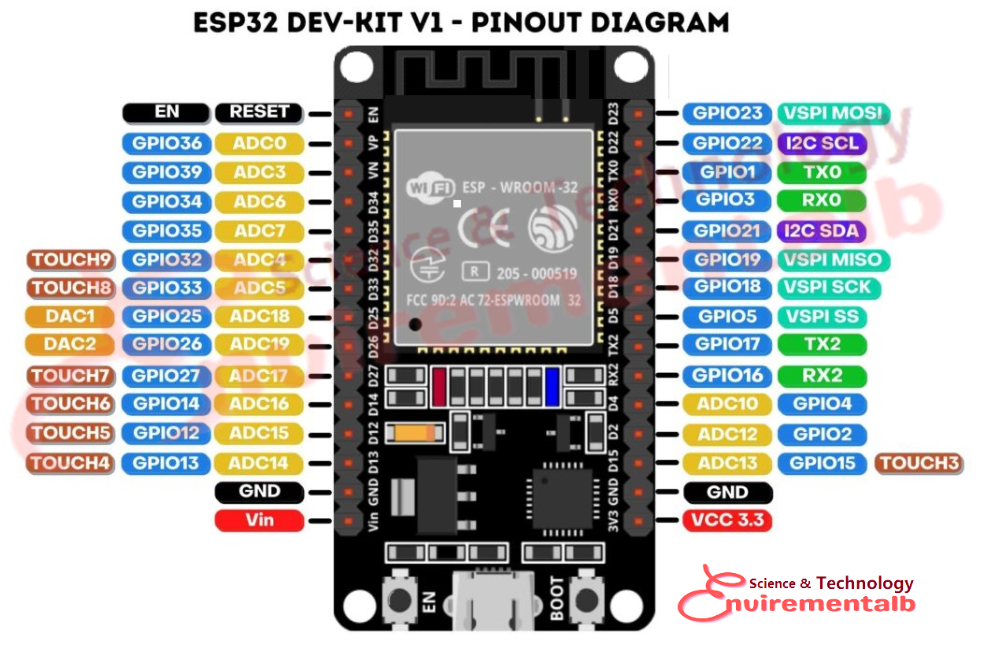

```c++:
#include <WiFi.h>
#include <PubSubClient.h>

const char* ssid = "MEGACABLE-C3C8";
const char* password = "2R8CNZ47DAR4";
const char* mqtt_server = "3.74.78.41";
const char* mqtt_topic_distance_a = "sensor/A";
const char* mqtt_topic_distance_b = "sensor/B";
const char* mqtt_topic_motor = "motor";

const int trigPinA = 21; // Pin 21 (GPIO21) para el sensor A
const int echoPinA = 22; // Pin 22 (GPIO22) para el sensor A
const int trigPinB = 19; // Pin 19 (GPIO19) para el sensor B
const int echoPinB = 18; // Pin 18 (GPIO18) para el sensor B
const int motorPin = 5;  // Pin 5  (GPIO5)  para el motor

WiFiClient espClient;
PubSubClient client(espClient);
bool mqttConnected = false;

float readDistance(int trigPin, int echoPin) {
  digitalWrite(trigPin, LOW);
  delayMicroseconds(2);
  digitalWrite(trigPin, HIGH);
  delayMicroseconds(10);
  digitalWrite(trigPin, LOW);
  long duration = pulseIn(echoPin, HIGH, 30000); // Tiempo de espera máximo en microsegundos
  if (duration == 0) {
    return 0; // Si el tiempo de espera es 0, se asume que no hay objeto detectado
  }
  return duration * 0.0343 / 2;
}

void setupWiFi() {
  delay(10);
  Serial.println();
  Serial.print("Connecting to ");
  Serial.println(ssid);

  WiFi.begin(ssid, password);

  while (WiFi.status() != WL_CONNECTED) {
    delay(500);
    Serial.print(".");
  }

  Serial.println("");
  Serial.println("WiFi connected");
  Serial.println("IP address: ");
  Serial.println(WiFi.localIP());
}

void reconnect() {
  while (!client.connected()) {
    Serial.print("Attempting MQTT connection...");
    if (client.connect("ESP32Client")) {
      Serial.println("connected");
      mqttConnected = true;
    } else {
      Serial.print("failed, rc=");
      Serial.print(client.state());
      Serial.println(" try again in 5 seconds");
      delay(5000);
    }
  }
}

void setup() {
  Serial.begin(9600);
  pinMode(trigPinA, OUTPUT);
  pinMode(echoPinA, INPUT);
  pinMode(trigPinB, OUTPUT);
  pinMode(echoPinB, INPUT);
  pinMode(motorPin, OUTPUT);

  setupWiFi();
  client.setServer(mqtt_server, 1883);
}

void loop() {
  if (!mqttConnected) {
    reconnect();
  }
  client.loop();

  float distanceA = readDistance(trigPinA, echoPinA);
  float distanceB = readDistance(trigPinB, echoPinB);

  Serial.print("Distance A: ");
  Serial.print(distanceA);
  Serial.print(" cm, Distance B: ");
  Serial.print(distanceB);
  Serial.println(" cm");

if (distanceA >= 9.0 && distanceB < 9.0) {
    digitalWrite(5, HIGH); // Enciende el motor (bomba de agua)
    client.publish(mqtt_topic_motor, "ON");
  } else {
    digitalWrite(5, LOW); // Apaga el motor (bomba de agua)
    client.publish(mqtt_topic_motor, "OFF");
  }

  delay(1000); // Añade una pausa de 1 segundo para no sobrecargar MQTT
}
```


Nota: en el diagrama se usa un Arduino Uno para ilustrar a la Esp32, la siguiente tabla ilustra el equivalente en el pin al momento de realizarla.

| Conexión Arduino |Conexión Esp32 | Funcion |
|:------------------:|:----------------:| : ------- :|
| Pin 11| Pin  21| Trigger A |
| Pin 12 | Pin 22| Echo A |
| Pin 10| Pin  19| Trigger B |
| Pin 9| Pin  18| Echo B |
| Pin 8 | Pin 5 | Control Motor |

El modelo usado en esta practica corresponde a una Esp32 Dev Module de 30 pines:




